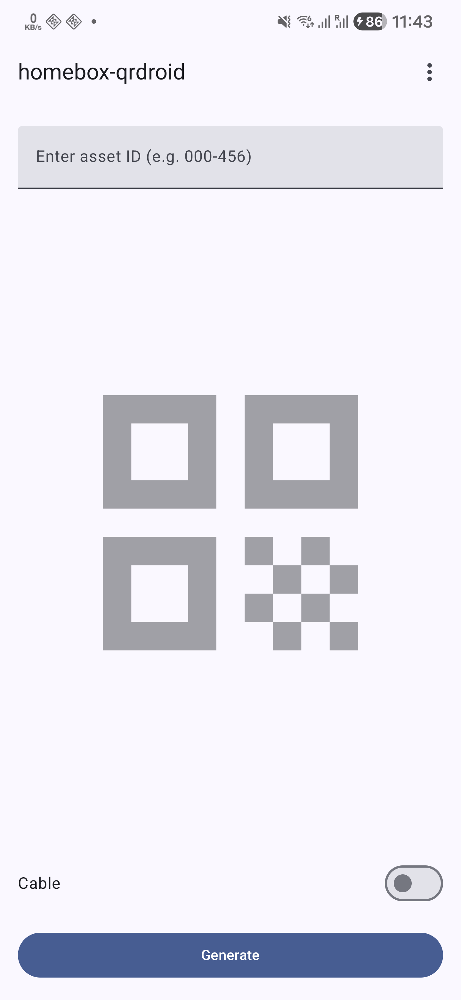

# homebox-qrdroid

Small Android app to generate QR codes in Homebox asset ID format for printing on label makers

## Why?

The alternative (that I've been using for quite some time) is [homebox-auto-print][homebox-auto-print], which worked quite well with `ptouch-print` but was inconvenient to use, since you have to carry around a laptop.

[homebox-auto-print]: https://github.com/ericswpark/homebox-auto-print

## Usage

Set your Homebox instance URL in settings, then enter the asset tag and click on "Generate".

"Cable" mode will make a longer label with a gap in between, to be wrapped around a cable.
